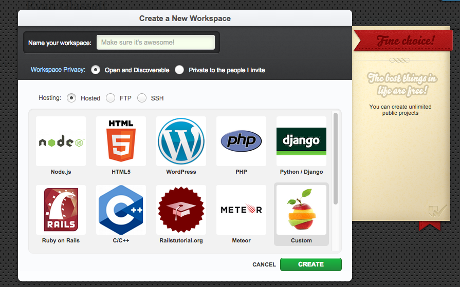
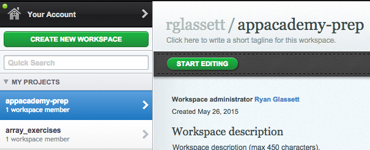
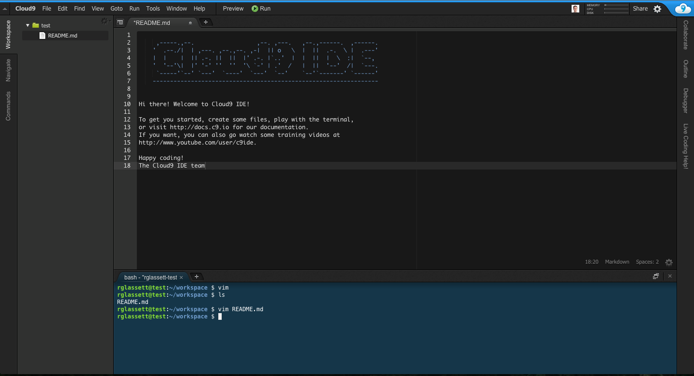
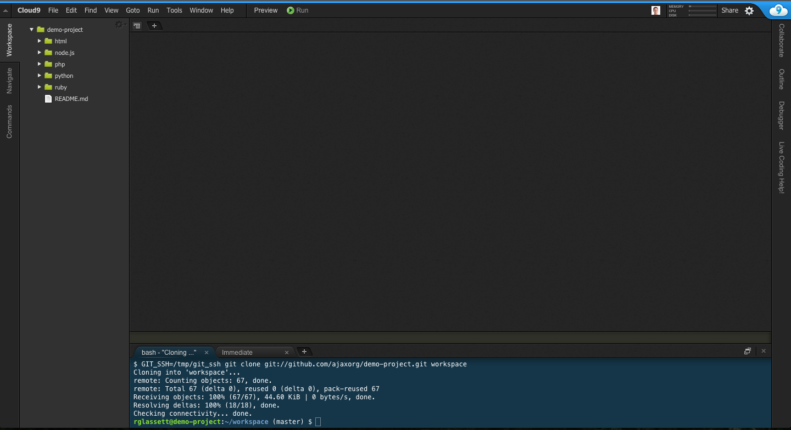
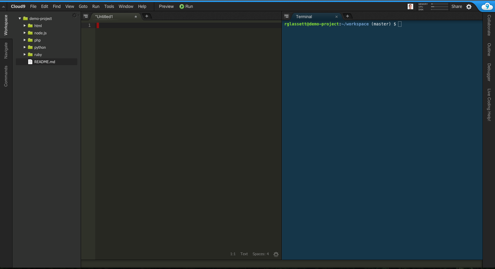
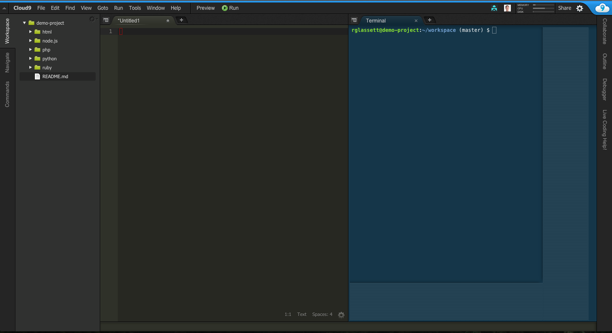

# Cloud9

[Cloud9][cloud9] will be our environment of choice for programming
during App Academy Prep. It has many of the same features as more
powerful desktop editors like Sublime Text or Atom, along with a
built-in terminal and robust support for collaboration.

[cloud9]: https://c9.io/

### Registration

We encourage you to register for Cloud9 with your Github account. This
will automate some nice integrations with Github, and has the nice side
effect of allowing us to more easily find your workspace.

### Creating a workspace

There should be a button on the left-hand side of the window labeled
"Create a New Workspace". Click this button and you'll see something
like this:



Name your workspace "appacademy-prep" and choose the **Custom** option.
Once you've filled out the form, click the "Create" button below. You
can enter the workspace by selecting it from the menu on the left and
then clicking the "Start Editing" button.



If you've chosen the "Full IDE" option, your workspace will look
something like this:



Once you've entered the workspace, the basic workflow will be:

0. Create folders and files using the tree navigator on the left.
0. Write your Ruby code in the text editor, top and center.
0. Run your code in the terminal at the bottom.

The terminal behaves almost exactly as it would on a Mac. You can
install gems and run the programs you've written with commands like
`ruby hello_world.rb` This will allow you to see any output and error
messages produced by your program.

### Settings

You'll find that Cloud9 has good support for customization; you can
tweak the color scheme, window arrangement, and such to your heart's
content. Before you start working, please take the time to apply the
following settings. Our office workstations are configured to use these
options, and we feel this is the most sensible configuration for Ruby
development.

#### View (accessible from the top navigation bar)
* Wrap Lines: on
* Wrap to Print Margin: on

#### Preferences (under Cloud9, or by pressing `CMD + ,`)
##### Project Settings > Code Editor (Ace)
* Soft Tabs: 2 spaces

##### Settings > User Interface
* Use an Asterisk (\*) to Mark Changed Tabs: on

##### Settings > Code Editor (Ace)
* Auto-pair Brackets, Quotes, etc.: on
* Wrap Selection with Brackets, Quotes, etc.: on
* Highlight Active Line: on
* Highlight Gutter Line: on
* Show Gutter: on
* Show Print Margin: on, set to 80

### Recommended file structure

We recommend organizing your projects first by week, then by day. This
has been the easiest to work with in our experience:

```
appacademy-prep/
 |- w1/
 |  |- w1d1/
 |  |  |- array.rb
 |  |
 |  |- w1d2/
 |
 |- w2/
```

### Collaborating in Cloud9

There are a couple "quirks" to the Cloud9 editor that are good to be
aware of.

#### Sharing a Terminal
The workspace's terminal should be shared by default. If for some reason
you and your partner find yourselves looking at different terminals, you
should be able to get it back into a shared state by following these
steps:

#### USER A: Identify your TMUX session

```
  $ tmux display-message -p '#S'
  username@workspace_042
```

#### USER B: (on the same workspace) - switch to that terminal

```
  $ tmux switch -t username@workspace_042
```

#### Shared Terminal View
If you've used a Cloud9 workspace on your own before, you're probably
familiar with the default window arrangement:



The terminal sits at the bottom, and you can use it just like you would
use the terminal on your own machine. You can enter commands, scroll up
and down through the history, and so forth. If you'd like, you can also
choose a different layout from the list under **View > Layout**. The
"Horizontal Split" option looks like this:



This gives you some more room vertically, so it's easier to look through
the terminal's history at a glance. Let's say we start using this layout
and invite a friend (or a TA) into our workspace. In this case,
something interesting happens:



What's going on here? You'll notice that part of the terminal has been
grayed out. In the "shared" mode, only one user has full control over
the terminal. We'll call this user the host. To the host user, the
terminal appears and behaves normally: it can be resized, scrolled
through, and so forth. Guest users can still enter text and run commands
in the terminal, but they get a restricted view: the active area of
their terminal is restricted to the visible area of the host's terminal;
the rest of the window is disabled (grayed out). Guests also can't
scroll through the terminal's history.

How can we deal with this? There are two options.

1. Have both users use the Horizontal Split layout to maximize the
   visible area of the terminal on both screens.
2. Have each user run commands in their own terminal window. This is not
   ideal; however, it does help to avoid the wonky behavior described
   above.
